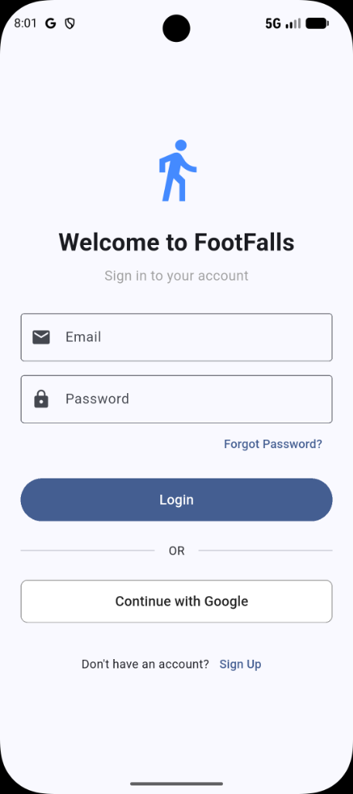
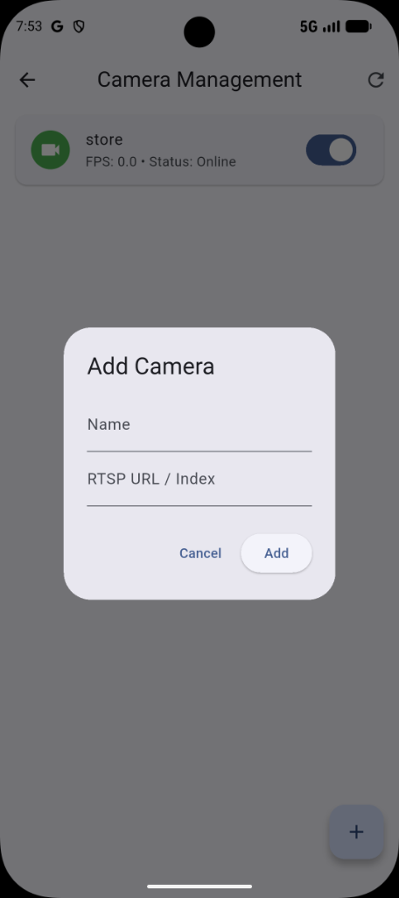
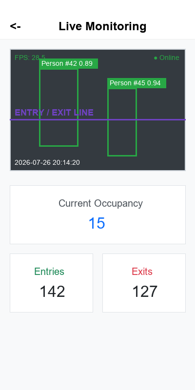
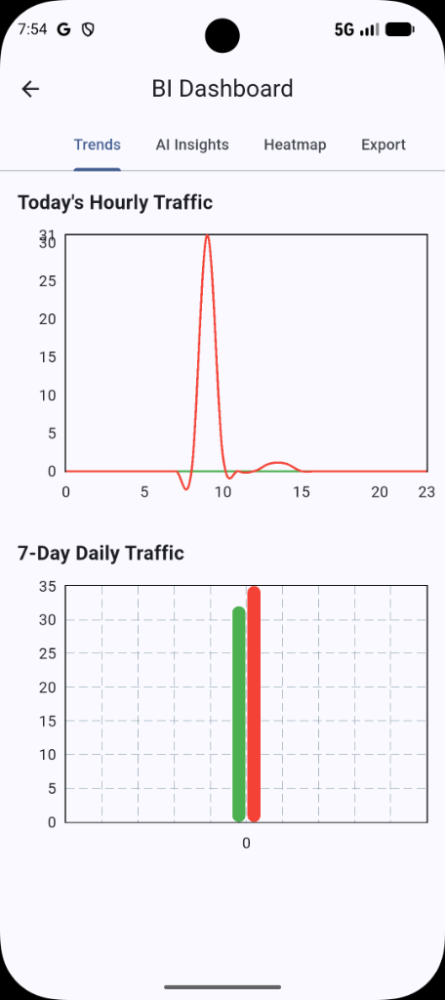
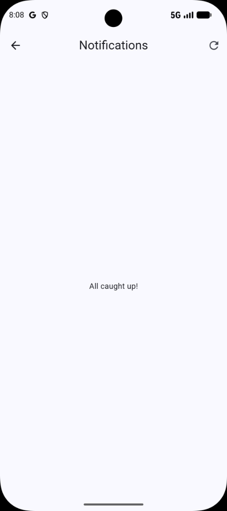
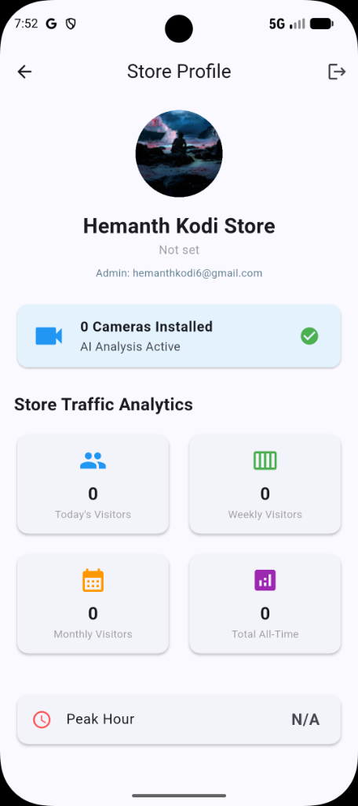
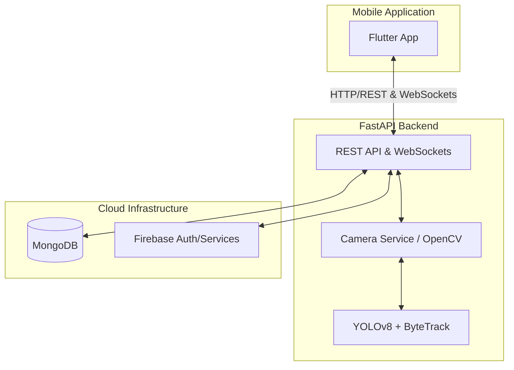

<div align="center">
  
# 🛒 FootFalls Analytics

**AI-Powered Real-Time Footfall Analytics System for Retail Stores**

[](https://flutter.dev)
[](https://fastapi.tiangolo.com/)
[](https://www.python.org/)
[](https://www.mongodb.com/)
[](https://firebase.google.com/)
[](https://render.com/)

</div>

---

## 📖 Overview

**FootFalls Analytics** is a state-of-the-art computer vision application designed to provide retail stores with deep insights into customer traffic. By leveraging advanced object detection (**YOLOv8**) and tracking (**ByteTrack**), the system processes live camera feeds to autonomously monitor occupancy, count entries and exits, and stream real-time analytics to a mobile dashboard.

Whether you are optimizing store layouts, scheduling staff based on peak hours, or simply monitoring capacity, FootFalls Analytics provides a comprehensive, scalable, and production-ready solution.

---

## ✨ Features

- **Real-time People Detection**: High-accuracy pedestrian detection utilizing YOLOv8.
- **Multi-Object Tracking**: Persistent ID tracking through occlusions using ByteTrack.
- **Live Camera Monitoring**: Low-latency video streaming to the mobile app via WebSockets.
- **Entry & Exit Counting**: Virtual tripwires automatically log store traffic.
- **Occupancy Monitoring**: Real-time capacity calculations.
- **Analytics Dashboard**: Beautiful UI for visualizing traffic trends.
- **Camera Management**: Register, enable, and monitor multiple camera streams.
- **Firebase Integration**: Secure user authentication and cloud synchronization.
- **FastAPI REST API**: High-performance backend routing and endpoints.
- **Analytics Export**: Generate and download reports in CSV/PDF formats.
- **Heatmap Analytics**: Spatial analysis of high-traffic zones.
- **Production-ready**: Fully compiled Android APK ready for deployment.

---

## 📱 Application Screenshots

| Login | Dashboard |
| :---: | :---: |
|  |  |
| **Camera Management** | **Live Monitoring** |
|  |  |
| **AI Insights** | **Heatmaps** |
|  |  |
| **Trends** | **Export Reports** |
|  |  |
| **Notifications** | **Reports** |
|  |  |
| **Store Profile** | |
|  | |

---

## 🛠️ Tech Stack

| Category | Technology |
| :--- | :--- |
| **Frontend** | Flutter, Dart, Riverpod |
| **Backend** | FastAPI, Python, Uvicorn |
| **AI / Computer Vision** | YOLOv8 (Ultralytics), ByteTrack, OpenCV |
| **Database** | MongoDB (Motor Async) |
| **Cloud Hosting** | Render |
| **Auth & Services** | Firebase Admin SDK, Google Cloud Credentials |
| **Communication** | REST API, WebSockets (Binary + JSON payloads) |

---

## 🏗️ Architecture



---

## 📁 Project Structure

```text
FootFalls-Analytics/
│
├── backend/                  # Python FastAPI Backend
│   ├── app/
│   │   ├── api/              # REST & WebSocket endpoints
│   │   ├── core/             # Configuration & DB setup
│   │   ├── models/           # Pydantic models
│   │   ├── services/         # YOLO, Tracking, OpenCV workers
│   │   └── main.py           # Application entry point
│   └── requirements.txt      # Python dependencies
│
└── mobile-app/               # Flutter Frontend
    ├── android/              # Native Android config & Keystore
    ├── ios/                  # Native iOS config
    ├── lib/
    │   ├── core/             # Environment configs & themes
    │   ├── models/           # Data models
    │   ├── providers/        # State management (Riverpod)
    │   ├── screens/          # UI Views
    │   └── services/         # API & WebSocket clients
    └── pubspec.yaml          # Flutter dependencies
```

---

## 🔌 API Features

The backend exposes a rich set of REST and WebSocket APIs:
- **`GET /cameras`**: Retrieve all registered cameras.
- **`POST /cameras`**: Register a new IP/RTSP camera.
- **`GET /analytics/dashboard`**: Fetch aggregated traffic metrics (today, this week, total).
- **`WS /ws/live`**: Global WebSocket for live dashboard metric updates.
- **`WS /ws/video/{camera_id}`**: High-performance binary WebSocket streaming real-time JPEG frames and YOLO metadata.

---

## 🚀 Installation

### 1. Backend Setup (Python)
```bash
cd backend
python -m venv venv
source venv/bin/activate  # Or `venv\Scripts\activate` on Windows
pip install -r requirements.txt
```

### 2. Environment Variables
Create a `.env` file in the `backend/` directory:
```env
MONGODB_URL=mongodb+srv://<user>:<password>@cluster.mongodb.net
FIREBASE_CREDENTIALS_JSON={"type": "service_account", ...}
```

### 3. Running Locally
Start the FastAPI server:
```bash
uvicorn app.main:app --host 0.0.0.0 --port 8000 --reload
```
API Documentation will be available at `http://localhost:8000/docs`.

### 4. Flutter Setup
```bash
cd mobile-app
flutter pub get
flutter run
```

---

## ☁️ Deployment

The backend is fully configured for continuous deployment on **Render**. 
1. Connect your GitHub repository to a new Render Web Service.
2. Set the build command to `pip install -r requirements.txt`.
3. Set the start command to `uvicorn app.main:app --host 0.0.0.0 --port 10000`.
4. Inject your `FIREBASE_CREDENTIALS_JSON` and `MONGODB_URL` in the Render Environment Variables tab.

---

## 📱 Screenshots

<div align="center">
  
  
  
  <br/>
  
  
  
</div>

---

## 🎥 Demo

*[Insert Link to YouTube / Loom Demo Video Here]*

---

## 📦 APK Installation

A signed production release of the Android application is available. 

1. Download the `app-release.apk` from the [Releases](https://github.com/hemanthkumar-del/FootFalls-Analytics/releases) page.
2. Transfer the APK to your Android device.
3. Open the file and follow the system prompts to install (you may need to allow installation from unknown sources).
4. The app will automatically connect to the deployed production backend.

---

## 🔮 Future Improvements

- **Multi-camera Support**: Stitching and tracking a single ID across multiple overlapping camera FOVs.
- **Heatmaps**: Visualizing customer dwell times and popular store aisles.
- **AI Forecasting**: Time-series prediction for predicting future store traffic based on historical data.
- **Cloud Recording**: Trigger-based saving of specific security events to cloud storage.
- **Admin Web Dashboard**: A React/Next.js companion web portal for enterprise managers.

---

## 🐳 Docker Setup

FootFalls Analytics is fully containerized for enterprise deployments.

### Prerequisites
- [Docker Desktop](https://www.docker.com/products/docker-desktop/) installed and running.
- Docker Compose (included with Docker Desktop).

### 1. Configuration
First, copy the example environment file and configure it:
```bash
cp backend/.env.example backend/.env
```
Ensure your `FIREBASE_PROJECT_ID` and other necessary variables are set.

### 2. Build and Run
Start the entire stack (FastAPI Backend + MongoDB) in detached mode:
```bash
docker compose up -d --build
```
Docker Compose will build the backend multi-stage image (caching python dependencies efficiently) and start MongoDB. The backend will wait until MongoDB is healthy before fully starting.

### 3. Check Logs
To view the logs of the backend:
```bash
docker compose logs -f backend
```

### 4. Stop Services
To stop the containers without destroying the MongoDB persistent volume:
```bash
docker compose down
```

### 5. Troubleshooting
If the YOLOv8 model fails to download due to network issues, ensure your container has outbound internet access.
If you need to rebuild without using cache:
```bash
docker compose build --no-cache
```

---

## 👨‍💻 Author

**Hemanth Kumar Kodi**

- GitHub: [@hemanthkumar-del](https://github.com/hemanthkumar-del)
- LinkedIn: [Hemanth Kodi](https://www.linkedin.com/in/hemanth-kodi-253351328)

---
<div align="center">
  <i>If you find this project interesting, please consider giving it a ⭐!</i>
</div>
