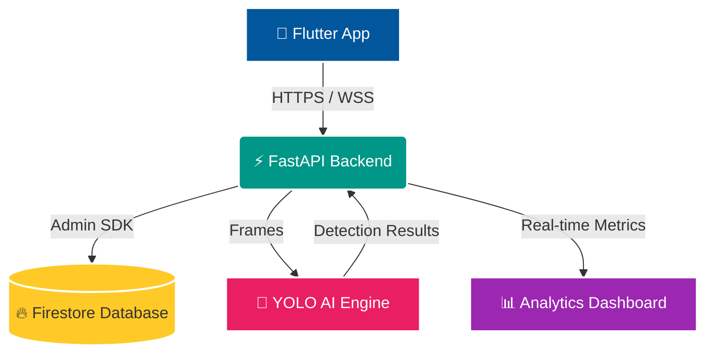

<div align="center">
  
  
  
  <br/>
  <br/>
  <h1>🚀 FootFalls Analytics</h1>
  <p><b>An AI-powered Footfall Analytics platform converting CCTV camera feeds into real-time business insights using Computer Vision.</b></p>
</div>

---

## 📖 Table of Contents
- [Project Overview](#-project-overview)
- [Features](#-features)
- [Tech Stack](#-tech-stack)
- [Architecture](#-architecture)
- [Screenshots](#-screenshots)
- [Installation](#-installation)
- [API Documentation](#-api-documentation)
- [Live Backend](#-live-backend)
- [Download APK](#-download-apk)
- [Folder Structure](#-folder-structure)
- [Future Improvements](#-future-improvements)
- [Author](#-author)
- [License](#-license)

---

## 🎯 Project Overview

FootFalls Analytics aims to revolutionize how physical stores analyze their customer traffic. By utilizing advanced computer vision AI directly on CCTV camera feeds, the system provides accurate, real-time footfall counting, occupancy tracking, and actionable business insights.

**Why businesses need Footfall Analytics:**
- **Optimize Staffing:** Align employee schedules with peak customer traffic hours.
- **Conversion Rates:** Compare footfall metrics against sales data to calculate true conversion rates.
- **Crowd Control:** Monitor live occupancy limits for safety and compliance.
- **Marketing ROI:** Measure the impact of physical marketing campaigns by analyzing traffic trends.

---

## ✨ Features

- **AI Person Detection**: Robust tracking using Ultralytics YOLOv8.
- **Footfall Counting**: Real-time bi-directional (entry/exit) counter.
- **Live Analytics Dashboard**: Highly interactive charts and metrics.
- **Firebase Authentication**: Secure Google and Email/Password login.
- **Firestore Database**: Low-latency, scalable NoSQL data storage.
- **Real-time WebSocket Updates**: Live video streaming from the AI engine.
- **REST APIs**: Full suite of well-documented backend endpoints.
- **Mobile Application**: Cross-platform Flutter app for managers on the go.
- **Cloud Deployment**: Containerized and deployed on Render.
- **Responsive UI**: Adaptive mobile and desktop layouts.

---

## 🛠 Tech Stack

| Layer | Technology |
|---|---|
| **Frontend** |   |
| **Backend** |   |
| **Database** |  (Firestore) |
| **Authentication** | Firebase Authentication |
| **AI Engine** | YOLOv8 (Ultralytics) |
| **Realtime** | WebSockets |
| **Deployment** |   Render |
| **Version Control**|   |

---

## 📐 Architecture



---

## 📸 Screenshots

| Login Screen | Live Dashboard |
| :---: | :---: |
|  |  |
| **Camera Live Feed** | **Analytics & Trends** |
|  |  |

---

## ⚙️ Installation

### Backend

1. **Clone the repository:**
   ```bash
   git clone https://github.com/hemanthkumar-del/FootFalls-Analytics.git
   cd FootFalls-Analytics/backend
   ```
2. **Install Python dependencies:**
   ```bash
   pip install -r requirements.txt
   ```
3. **Run the FastAPI server:**
   ```bash
   uvicorn main:app --reload --port 8000
   ```

### Flutter Frontend

1. **Navigate to the app directory:**
   ```bash
   cd ../mobile-app
   ```
2. **Install dependencies:**
   ```bash
   flutter pub get
   ```
3. **Run the application:**
   ```bash
   flutter run
   ```

---

## 🔌 API Documentation

Explore and test the full REST API securely directly from your browser:
🔗 **[Swagger UI Documentation](https://footfalls-analytics.onrender.com/docs)**

---

## ☁️ Live Backend

The production API is actively hosted on Render:
🔗 **[https://footfalls-analytics.onrender.com](https://footfalls-analytics.onrender.com)**

---

## 📥 Download APK

Want to try the app on your Android device? Download the latest production release APK from our GitHub Releases page!

📱 **[Download FootFalls Analytics v1.0.0 APK](https://github.com/hemanthkumar-del/FootFalls-Analytics/releases/latest)**

---

## 📂 Folder Structure

```text
FootFalls-Analytics/
├── backend/            # FastAPI Python Server
├── mobile-app/         # Flutter Android/iOS App
├── ai-engine/          # YOLOv8 Computer Vision Models
├── k8s/                # Kubernetes Deployment Manifests
└── docs/               # Screenshots and Documentation Assets
```

---

## 🔮 Future Improvements

- [ ] Multi-camera support
- [ ] Heatmap Analytics
- [ ] Face Recognition
- [ ] Push Notifications
- [ ] Offline Sync
- [ ] Admin Web Dashboard
- [ ] AI Prediction Models

---

## 👨‍💻 Author

**Hemanth Kumar Kodi**
- GitHub: [@hemanthkumar-del](https://github.com/hemanthkumar-del)
- LinkedIn: [Hemanth Kodi](https://www.linkedin.com/in/hemanth-kodi-253351328)

---

## 📄 License

This project is licensed under the **MIT License**. See the `LICENSE` file for more details.

---

> If you like this project, consider giving it a ⭐ on GitHub.
